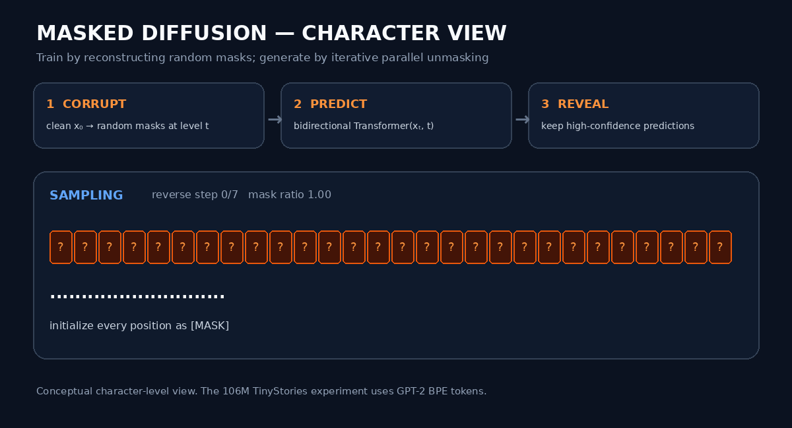
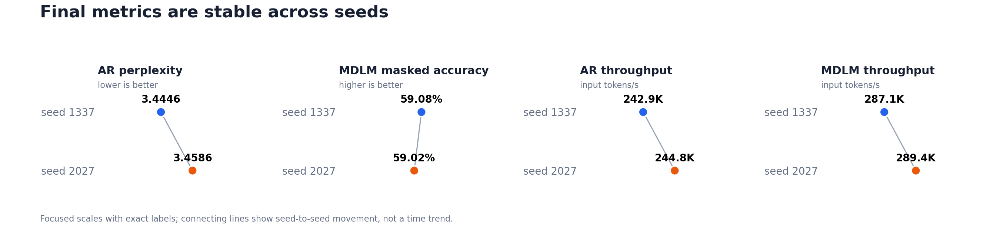
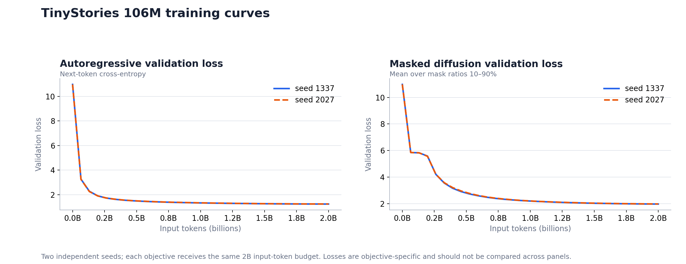
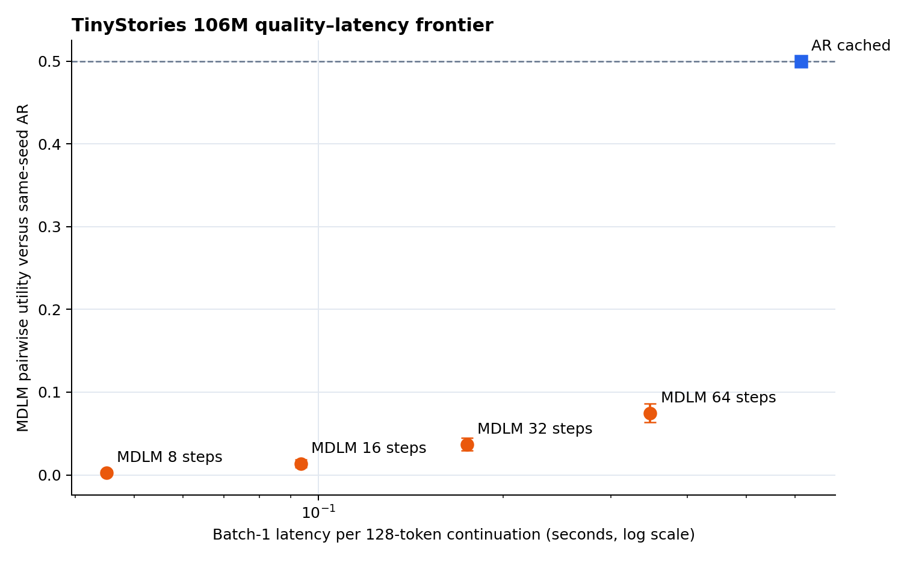

# nanoDiffusionLab

[](https://github.com/tutao0123/nanoDiffusionLab/actions/workflows/ci.yml)
[](https://www.python.org/)
[](LICENSE)

**A compact, from-scratch implementation for training diffusion language models, with a complete
GPT-style autoregressive language-model implementation in the same codebase.**

[Chinese](README.zh-CN.md) · [Architecture](docs/architecture.md) ·
[Training report](reports/tinystories_106m.md) ·
[Generation benchmark](reports/tinystories_106m_generation.md) ·
[Revisable decoding](docs/editable_diffusion_decoding.md) ·
[Step-by-step tutorial](tutorials/zh-CN/README.md) · [Contributing](CONTRIBUTING.md)


## Why this project?

nanoDiffusionLab borrows nanoGPT's small-and-readable philosophy while keeping its implementation
independent. Its primary goal is to make masked-diffusion language-model training understandable
and runnable end to end—not merely to provide a sampling demo. The repository implements data
loading, random-mask corruption, noise-level conditioning, masked-position training, evaluation,
checkpointing, DDP, and iterative parallel generation.

The repository also contains a complete GPT-style autoregressive training and generation path:
causal attention, next-token cross-entropy, perplexity evaluation, sampling, and K/V-cached
decoding. This path is useful as a small GPT implementation on its own and as a controlled baseline
for diffusion experiments.

Both objectives use the same Transformer implementation, so the backbone, data, context length,
and input-token budget can be held fixed for direct experiments.

| Objective | Attention | Training signal | Decoding |
|---|---|---|---|
| Autoregressive (AR) | Causal | Predict the next token | Sequential, left to right |
| Masked diffusion (MDLM) | Bidirectional | Restore randomly masked tokens | Iterative parallel unmasking |

Block diffusion is the next architecture milestone and is not implemented yet.

## How masked diffusion works



The animation shows the core implementation pattern:

1. **Corrupt during training:** sample a noise level and replace a corresponding fraction of the
   clean sequence with mask tokens.
2. **Predict in both directions:** feed the corrupted sequence and noise level to a bidirectional
   Transformer, and compute cross-entropy only at masked positions.
3. **Decode in parallel:** begin generation from an all-mask sequence, predict every unresolved
   position, reveal a high-confidence subset, and repeat until no masks remain.

The animation uses characters to make individual positions easy to see. The completed 106M
TinyStories experiment applies the same process to GPT-2 BPE tokens rather than raw characters.

## Completed 106M experiment

Two independent seeds were trained on the pinned TinyStories dataset with GPT-2 BPE. Each
objective received **2.000B input tokens** using the same model backbone and context length.



| Result | AR seed 1337 | AR seed 2027 | MDLM seed 1337 | MDLM seed 2027 |
|---|---:|---:|---:|---:|
| Parameters | 106.28M | 106.28M | 106.61M | 106.61M |
| Validation loss | 1.2368 | 1.2409 | 1.9635 | 1.9705 |
| Perplexity | 3.4446 | 3.4586 | — | — |
| Masked accuracy | — | — | 59.08% | 59.02% |
| Training throughput | 242.9K tok/s | 244.8K tok/s | 287.1K tok/s | 289.4K tok/s |

> AR cross-entropy and MDLM denoising loss are objective-specific. They must not be interpreted as
> the same likelihood metric.



The near-overlapping curves and close final metrics show that both objectives are reproducible
across the two tested seeds. The included fixed-seed samples are currently more coherent for AR;
improving MDLM sampling quality remains an active research target.

The completed 10,000-sample generation benchmark quantifies that gap. At batch 1, MDLM sampling is
1.76× faster than cached AR at 64 denoising steps and 13.63× faster at 8 steps. AR nevertheless wins
the large majority of blinded quality comparisons: aggregate MDLM pairwise utility rises from
0.0028 at 8 steps to 0.0745 at 64 steps. Flash and Pro judges agree on 98% of the audited pairs.



### Revisable diffusion decoding

Inspired by the editing perspective in the
[LLaDA2.2 technical report](https://github.com/inclusionAI/LLaDA2.X/blob/main/LLaDA2_2_tech_report.pdf),
we tested a minimal sampler-only form of revisability: low-confidence revealed MDLM tokens can be
masked and sampled again, with EOT protection and a final-quarter decay. On 2,000 continuations,
the selected variant reduced repeated 4-grams from 0.0951 to 0.0672, but blinded judges still
preferred the original MDLM (remask utility 0.357 with Flash and 0.300 in the Pro audit). It was
also 6.1% slower than the original MDLM at batch 1.

This negative result keeps the project's AR–diffusion comparison honest: proxy diversity improved,
story preference did not. Remasking is experimental and **disabled by default**. See the
[interpretation and architecture comparison](docs/editable_diffusion_decoding.md) and
[formal report](reports/tinystories_106m_remask_generation.md).

### Example generations from the final checkpoints

The following are verbatim excerpts from the
[fixed 1,000-prompt evaluation](reports/tinystories_106m_generation.md). Each prompt contains 32
GPT-2 tokens and each model was asked for a 128-token continuation in BF16. MDLM uses 64 denoising
steps. `[...]` only marks where an excerpt was shortened.

The two cases are intentionally complementary: the first exposes the repetition that remains common
in the current MDLM sampler, while the second shows a case where its continuation is comparatively
coherent. They illustrate model behavior but do not replace the aggregate benchmark above.

**Example 1 — seed 1337, prompt 0**

Input:

```text
Tom and Mia were adventurous kids. They liked to explore new places and have fun. One day, they found a big tube in the park. It was long
```

AR output:

```text
and round and shiny. They wondered what was inside.

"Let's go in the tube," Tom said.

"Okay," Mia said.

They crawled into the tube and saw a dark and narrow tunnel. It was not clear. It had a lot of rocks and dirt and bugs. They heard strange noises and saw bright colors. They were curious and excited. [...]
```

MDLM output, 64 steps:

```text
and hot and made. They
"Let's go, tube!" Tom said.

"OK, but be careful. The tube is very heavy," Mia said said.

They ran to the tube. They put the tube on the tube. They put the tube on the tube. They put the tube on the tube. They were happy. [...]
```

**Example 2 — seed 2027, prompt 573**

Input:

```text
Once upon a time, there was a little boy named Tim. Tim had a big toy car that he loved to play with. One day, Tim's toy
```

AR output:

```text
car started to break. He was very sad and didn't know what to do.

Tim's mom saw that he was worried, so she took him to the store to sell some things. At the store, Tim saw a man who needed money, but not enough. [...]
```

MDLM output, 64 steps:

```text
car broke into many pieces. Tim was sad and didn't know what to do.

Tim asked mom for help and tried to fix the toy car. His mom saw him and was sad and said, "Don't worry, Tim. We need to fix it. Let's fix the car together." They went to the store and found a broken car on the shelf. She said, "Don't worry, Tim. We can fix your car. It's as good as new again." [...]
```

Detailed outputs:

- [seed 1337 comparison](reports/tinystories_106m.md)
- [seed 2027 comparison](reports/tinystories_106m_seed2027.md)
- [generation quality and speed benchmark](reports/tinystories_106m_generation.md)
- [revisable diffusion decoding experiment](docs/editable_diffusion_decoding.md)
- [implementation and early-run snapshot](reports/initial_run_report.html)

## Experiment platform

The reported runs were conducted on a single Linux server with:

- **4× NVIDIA A40 48 GB** GPUs;
- no NVLink, with every GPU-to-GPU path reported as PHB;
- all GPUs attached to the same NUMA node;
- PyTorch DistributedDataParallel with BF16;
- batch size 32 per GPU and 2 gradient-accumulation steps;
- an effective 262,144 input tokens per optimizer step.

This is a practical reference platform, not a hardware requirement. The reported throughput and
elapsed time are machine-specific; the model and experiment code can run on CPU, one GPU, or a DDP
setup with a different number of GPUs.

### Run it on stronger hardware

Experiments on newer or larger GPU systems are welcome. More compute can be used to test larger
models, longer token budgets, additional random seeds, longer contexts, more diffusion sampling
steps, or the planned block-diffusion objective. Useful extensions include:

- scaling the shared backbone to 350M, 1B, or larger while matching parameter counts;
- increasing the training-token budget and checking whether the AR/MDLM gap changes;
- measuring quality, sampling latency, and memory together instead of reporting loss alone;
- repeating each configuration across at least three seeds;
- benchmarking DDP scaling on NVLink, NVSwitch, H100, H200, B100, or other systems.

For a comparable contribution, report the GPU model and topology, software versions, precision,
world size, per-GPU batch size, gradient accumulation, parameter count, context length, input-token
budget, supervised-target count, random seeds, throughput, and objective-specific validation
metrics. Pull requests with reproducible configurations and reports are encouraged.

## What works

- end-to-end masked-diffusion language-model training and parallel sampling;
- end-to-end GPT-style autoregressive training and K/V-cached generation;
- one shared Transformer implementation for both objectives;
- character smoke tests and memory-mapped token shards;
- causal and bidirectional SDPA attention;
- masked-only output projection for lower MDLM memory;
- time/noise-level conditioning and parallel unmasking;
- CPU, single-GPU, and DDP training;
- BF16/FP16, gradient accumulation, checkpointing, and exact resume;
- atomic checkpoints, JSONL metrics, metadata, and source snapshots;
- fixed-token-budget comparison and deterministic evaluation.

## Quick start

Requires Python 3.10+ and PyTorch 2.3+.

New to language-model training? Follow the detailed
[Chinese step-by-step tutorial](tutorials/zh-CN/README.md), which covers tensor shapes, AR and MDLM
objectives, character smoke tests, TinyStories preparation, 4-GPU DDP, exact resume, evaluation,
and troubleshooting with copy-paste commands and expected results.

```bash
python -m venv .venv
source .venv/bin/activate
pip install -e ".[dev]"

mkdir -p data/tinyshakespeare
curl -L https://raw.githubusercontent.com/karpathy/char-rnn/master/data/tinyshakespeare/input.txt \
  -o data/tinyshakespeare/input.txt

python train.py --config configs/shakespeare_char.py
python sample.py --checkpoint out/shakespeare-mdlm/best.pt --show-steps
```

Add `--max-iters 10` for a plumbing check; meaningful samples require a real training run.

For a completely offline CPU check, train and sample both objectives on the included tiny fixture:

```bash
bash scripts/run_cpu_smoke.sh
```

Switch to AR without changing the shared backbone:

```bash
python train.py --config configs/shakespeare_char.py \
  --objective autoregressive --out-dir out/shakespeare-ar
```

## Reproduce the TinyStories experiment

The paired models use 12 layers, width 576, 9 heads, a 1024-token context, and approximately 106M
parameters.

```bash
pip install -e ".[data,dev]"
python scripts/prepare_tinystories.py
bash scripts/run_tinystories_pair.sh
```

To launch one objective manually on four GPUs:

```bash
python -m torch.distributed.run --standalone --nproc_per_node=4 train.py \
  --config configs/tinystories_106m.py \
  --objective autoregressive \
  --out-dir out/tinystories-106m-ar
```

Each run writes its resolved configuration, environment metadata, JSONL metrics, atomic resumable
checkpoints, milestone checkpoints, samples, and final summary. Use `--resume` to continue from
`last.pt`.

## Generation quality and speed benchmark

The evaluation workflow compares cached AR decoding against MDLM sampling at 8, 16, 32, and 64
steps. It selects 1000 deterministic validation prompts, generates from both training seeds, measures
single-GPU latency and memory, computes transparent diversity metrics, and performs blinded
same-seed pairwise judging.

```bash
pip install -e ".[data,eval,viz]"
export DEEPSEEK_API_KEY="..."  # keep this outside the repository
bash scripts/run_generation_benchmark.sh
```

DeepSeek V4 Flash judges all 8000 AR/MDLM pairs. DeepSeek V4 Pro audits a stratified set of 100
pairs, and the completed [benchmark report](reports/tinystories_106m_generation.md) includes exact
agreement, Cohen's kappa, and the quality-latency frontier. Every phase is resumable under
`out/tinystories-106m-generation-eval`; the API key is read only from the process environment.

For a small plumbing check, run `prepare` with 20 prompts and `generate --limit 2` before invoking
the judge. See `python scripts/benchmark_generation.py --help` for individual phases.

Regenerate the README figures from completed local runs:

```bash
pip install -e ".[viz]"
python scripts/render_readme_assets.py --refresh-data
```

## Hardware notes

For 100M–350M models on PCIe/PHB GPUs without NVLink:

- prefer DDP over tensor parallelism, FSDP, or ZeRO-3 at this scale;
- keep per-GPU micro-batches large enough to amortize all-reduce;
- use `no_sync()` during gradient accumulation;
- benchmark NCCL on the actual server before claiming scaling efficiency.

Configurations directly under `configs/` are runnable after following their documented data
preparation. Architecture-only targets live under `configs/experimental/`; they are not covered by
CI and must document their missing data contract. In particular,
`configs/experimental/fineweb_350m_target.py` is not yet a production FineWeb data recipe.

## Project map

```text
model.py                    shared Transformer and AR sampler
diffusion.py                corruption, denoising loss, parallel sampler
train.py                    token-budget training, evaluation, checkpointing, DDP
data.py                     character and memory-mapped token-shard loaders
evaluation.py               prompts, local metrics, judge validation, statistics
experiment.py               atomic artifacts and local experiment metadata
sample.py                   checkpoint loading and text generation
configs/                    runnable experiment configurations
configs/experimental/       documented, non-runnable architecture targets
scripts/                    data, training, evaluation, report, and figure workflows
tests/                      behavioral tests
docs/architecture.md        design choices and roadmap
```

## Contributing and citation

See [CONTRIBUTING.md](CONTRIBUTING.md) for development checks and the experiment-reporting
checklist. Use [CITATION.cff](CITATION.cff) when citing the software. Release history is recorded in
[CHANGELOG.md](CHANGELOG.md).

## License

MIT
