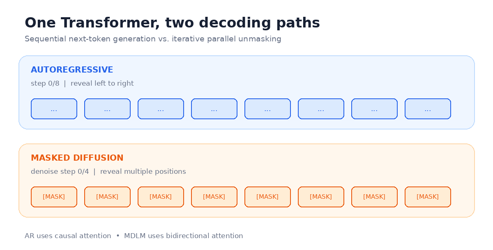

# nanoDiffusionLab

**一个用于公平比较自回归语言模型与扩散语言模型的精简实验平台。**

[English](README.md) · [架构说明](docs/architecture.md) ·
[实验报告](reports/tinystories_106m.md)



## 为什么做这个项目？

nanoDiffusionLab 借鉴 nanoGPT 代码紧凑、易读的理念，但保持独立实现。同一套 Transformer
目前支持两种可运行的训练目标，因此可以固定主干网络、数据、上下文长度与输入词元预算，进行
尽可能公平的比较。

| 目标 | 注意力 | 训练信号 | 解码方式 |
|---|---|---|---|
| 自回归模型 | 因果注意力 | 预测下一个词元 | 从左向右串行生成 |
| 掩码扩散模型 | 双向注意力 | 恢复随机掩码词元 | 迭代并行去掩码 |

块扩散是下一阶段架构目标，目前尚未实现。

## 掩码扩散如何工作


动画展示了当前实现的核心流程：

1. **训练时破坏：**采样一个噪声等级，并按照对应比例将干净序列中的位置替换为掩码词元。
2. **双向预测：**将破坏后的序列和噪声等级输入双向 Transformer，只在掩码位置计算交叉熵。
3. **并行解码：**生成时从全掩码序列开始，同时预测所有未恢复位置，每轮揭示一批高置信度结果，
   直到序列中不再存在掩码。

动画使用字符是为了清楚展示每个位置。已完成的 106M 参数 TinyStories 实验采用相同流程，但
实际处理的是 GPT-2 BPE 词元，而不是原始字符。

## 已完成的 106M 参数实验

我们使用固定版本的 TinyStories 数据集与 GPT-2 分词器完成了两个独立随机种子实验。两种目标
使用相同的模型主干和上下文长度，并分别训练 **20 亿输入词元**。


| 结果 | 自回归种子 1337 | 自回归种子 2027 | 掩码扩散种子 1337 | 掩码扩散种子 2027 |
|---|---:|---:|---:|---:|
| 参数量 | 106.28M | 106.28M | 106.61M | 106.61M |
| 验证损失 | 1.2368 | 1.2409 | 1.9635 | 1.9705 |
| 困惑度 | 3.4446 | 3.4586 | — | — |
| 掩码准确率 | — | — | 59.08% | 59.02% |
| 训练吞吐 | 24.29 万词元/秒 | 24.48 万词元/秒 | 28.71 万词元/秒 | 28.94 万词元/秒 |

> 自回归交叉熵和掩码扩散去噪损失属于不同目标，不能当作同一种似然指标直接比较。


两组曲线几乎重合，最终指标也十分接近，说明两种目标在测试的两个随机种子上均具有良好复现性。
从固定随机种子样例看，当前自回归模型的故事连贯性更好；提高掩码扩散采样质量仍是后续重点。

详细结果：

- [种子 1337 对比报告](reports/tinystories_106m.md)
- [种子 2027 对比报告](reports/tinystories_106m_seed2027.md)
- [实现与早期运行快照](reports/initial_run_report.html)

## 实验平台

上述实验在一台 Linux 服务器上完成，硬件与训练方式如下：

- **4 张 NVIDIA A40 48GB** 显卡；
- 显卡之间没有 NVLink，任意两张显卡之间均为 PHB 拓扑；
- 所有显卡位于同一个 NUMA 节点；
- 使用 PyTorch 分布式数据并行与 BF16 精度；
- 每张显卡的批量大小为 32，梯度累积 2 步；
- 每次优化器更新处理 262,144 个输入词元。

这是一套实用的参考平台，并不是运行项目的硬件门槛。代码也支持中央处理器、单张显卡和不同
显卡数量的分布式训练。报告中的吞吐与耗时只代表这台机器，不能直接外推到其他硬件。

### 欢迎使用更强的机器继续实验

欢迎在更新、更大规模的显卡系统上复现和扩展这些实验。更多算力可以用于更大的模型、更长的
训练预算、更多随机种子、更长上下文、更多扩散采样步数，以及后续的块扩散目标。例如：

- 将共享主干扩展到 350M、1B 或更大规模，同时尽量匹配两种目标的参数量；
- 增加训练词元预算，观察自回归与掩码扩散的差距是否发生变化；
- 同时测量生成质量、采样延迟和显存，而不只报告损失；
- 每个配置至少运行三个随机种子；
- 在 NVLink、NVSwitch、H100、H200、B100 或其他系统上测试分布式扩展效率。

为了让不同机器的结果可以比较，建议报告显卡型号与拓扑、软件版本、训练精度、进程数、每卡
批量大小、梯度累积、参数量、上下文长度、输入词元预算、有效监督词元数、随机种子、训练吞吐，
以及各目标专属的验证指标。欢迎提交包含可复现配置和实验报告的合并请求。

## 当前能力

- 同一套 Transformer 支持自回归与掩码扩散；
- 字符级快速测试和内存映射词元分片；
- 因果与双向缩放点积注意力；
- 仅投影掩码位置，降低掩码扩散显存占用；
- 时间与噪声等级条件，以及并行去掩码；
- 支持中央处理器、单卡和分布式数据并行训练；
- 支持 BF16、FP16、梯度累积、检查点和精确恢复；
- 保存原子检查点、逐行指标、环境元数据和源码快照；
- 固定词元预算比较和确定性评估。

## 快速开始

需要 Python 3.10 或更高版本，以及 PyTorch 2.3 或更高版本。

```bash
python -m venv .venv
source .venv/bin/activate
pip install -e ".[dev]"

mkdir -p data/tinyshakespeare
curl -L https://raw.githubusercontent.com/karpathy/char-rnn/master/data/tinyshakespeare/input.txt \
  -o data/tinyshakespeare/input.txt

python train.py --config configs/shakespeare_char.py
python sample.py --checkpoint out/shakespeare-mdlm/best.pt --show-steps
```

添加 `--max-iters 10` 可以快速检查训练流程；生成合理样例需要完整训练。

在不改变共享主干的情况下切换为自回归目标：

```bash
python train.py --config configs/shakespeare_char.py \
  --objective autoregressive --out-dir out/shakespeare-ar
```

## 复现 TinyStories 实验

成对模型使用 12 层、576 隐藏维度、9 个注意力头、1024 词元上下文，参数量约 106M。

```bash
pip install -e ".[data,dev]"
python scripts/prepare_tinystories.py
bash scripts/run_tinystories_pair.sh
```

在四张显卡上手动启动单个目标：

```bash
python -m torch.distributed.run --standalone --nproc_per_node=4 train.py \
  --config configs/tinystories_106m.py \
  --objective autoregressive \
  --out-dir out/tinystories-106m-ar
```

每次运行都会保存解析后的配置、环境信息、逐行指标、可恢复检查点、词元里程碑、生成样例与最终
摘要。使用 `--resume` 可以从 `last.pt` 继续训练。

## 生成质量与速度评估

评估流程比较带键值缓存的自回归解码和使用 8、16、32、64 步的掩码扩散采样。流程会从验证集
确定性选择 1000 个提示，使用两个训练随机种子生成样本，测量单卡延迟、吞吐与显存，计算透明的
多样性指标，并执行隐藏模型身份的同随机种子配对评审。

```bash
pip install -e ".[data,eval,viz]"
export DEEPSEEK_API_KEY="..."  # 密钥只放在进程环境中
bash scripts/run_generation_benchmark.sh
```

DeepSeek V4 Flash 评审全部 8000 个自回归与掩码扩散配对；DeepSeek V4 Pro 分层复核其中 100
个配对，报告同时给出完全一致率和 Cohen's kappa。每个阶段都可以从
`out/tinystories-106m-generation-eval` 恢复，密钥不会写入仓库或实验产物。

快速检查时可先使用 20 个提示执行 `prepare`，再执行带 `--limit 2` 的 `generate`。运行
`python scripts/benchmark_generation.py --help` 可以查看各个独立阶段。

从本地完整运行重新生成说明文档中的图片：

```bash
pip install -e ".[viz]"
python scripts/render_readme_assets.py --refresh-data
```

## 硬件建议

对于通过 PCIe 连接、没有 NVLink 的 100M 至 350M 参数模型：

- 当前规模优先使用分布式数据并行，而不是张量并行、全参数分片或 ZeRO-3；
- 使用足够大的每卡批量来摊薄全归约通信成本；
- 梯度累积期间使用 `no_sync()` 避免冗余通信；
- 在公布扩展效率前，应当在目标服务器上实际测试 NCCL。

`configs/fineweb_350m.py` 目前只是模型目标配置，尚未包含生产级 FineWeb 数据流程。

## 项目结构

```text
model.py                    共享 Transformer 与自回归采样器
diffusion.py                掩码破坏、去噪损失与并行采样器
train.py                    词元预算训练、评估、检查点与分布式训练
data.py                     字符与内存映射词元分片加载器
evaluation.py               提示抽样、本地指标、评审校验与统计
experiment.py               原子实验产物与本地环境元数据
compare_runs.py             成对实验报告
sample.py                   检查点加载与文本生成
configs/                    可运行的实验配置
scripts/                    数据、训练与绘图流程
tests/                      行为测试
docs/architecture.md        设计选择与路线图
```

## 许可证

MIT
