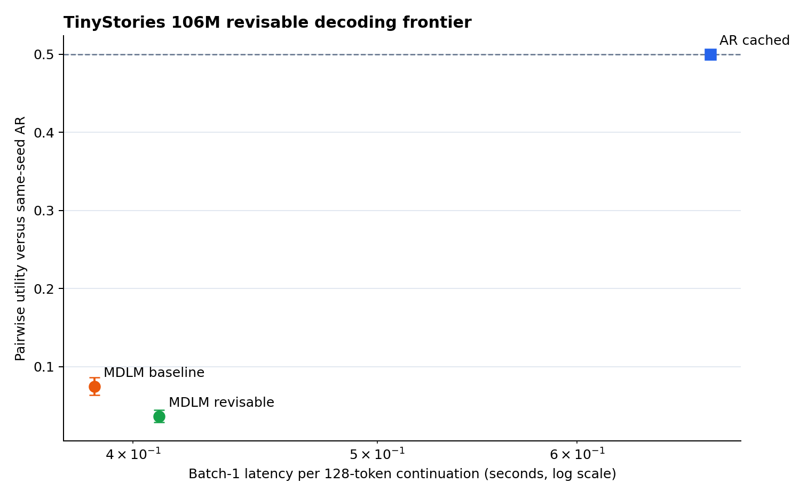

# TinyStories 106M Revisable Diffusion Decoding

This experiment tests whether sampler-side low-confidence remasking improves the 64-step MDLM
quality–speed trade-off. It uses the same Transformer, TinyStories data, GPT-2 tokenizer, two
training seeds, fixed prompts, and continuation settings as the original
[AR–MDLM generation benchmark](tinystories_106m_generation.md).

## Main result

The selected remask policy improves transparent repetition and diversity metrics, but makes
continuations worse under both blinded judges. It therefore remains experimental and disabled by
default.

| Decoder | EOT completion | Unique tokens | Distinct-3 | Repeated 4-grams |
|---|---:|---:|---:|---:|
| Cached AR | 0.252 | 0.565 | 0.950 | 0.0195 |
| Original MDLM, 64 steps | 0.265 | 0.410 | 0.832 | 0.0951 |
| Remask MDLM, 64 steps | 0.283 | 0.421 | 0.867 | 0.0672 |

Relative to the original MDLM, remasking reduces repeated 4-grams by 29.4%, increases distinct-3
by 0.034, and increases rather than decreases EOT completion. These proxy gains do not translate
to pairwise preference.

## Blinded quality

Every remask continuation was compared against the same-prompt, same-training-seed AR continuation
and original MDLM continuation. Pair identities were hidden and A/B positions were balanced.

| Judge and comparison | Pairs | Remask wins | Ties | Remask losses | Utility | 95% CI |
|---|---:|---:|---:|---:|---:|---:|
| Flash: remask vs AR | 2,000 | 64 | 17 | 1,919 | 0.036 | [0.029, 0.044] |
| Flash: remask vs original MDLM | 2,000 | 356 | 714 | 930 | 0.357 | [0.339, 0.372] |
| Pro audit: remask vs AR | 100 | 6 | 0 | 94 | 0.060 | [0.020, 0.110] |
| Pro audit: remask vs original MDLM | 100 | 27 | 6 | 67 | 0.300 | [0.220, 0.390] |

Utility assigns 1 to a remask win, 0.5 to a tie, and 0 to a loss. Flash and Pro exact agreement is
95% for remask-vs-AR and 61% for remask-vs-original-MDLM; Cohen's kappa is 0.897 and 0.400,
respectively. The lower exact agreement in the second group mainly reflects a large number of
Flash ties, while both judges' utility remains well below the 0.5 equal-preference point.

For context, the earlier Flash evaluation gave the original 64-step MDLM a 0.0745 utility against
AR. That historical row is useful for the frontier but is not treated as a simultaneous judge
measurement because provider behavior may change over time.

## Performance

The controlled same-run measurements use one NVIDIA A40, BF16 autocast, 10 warmup iterations, and
30 measured iterations for each decoder, seed, and batch size. Values below are means across the
two training seeds; peak memory is the larger of the two seed measurements.

| Decoder | Batch | Latency | Sequences/s | First update | Peak memory |
|---|---:|---:|---:|---:|---:|
| Cached AR | 1 | 0.678 s | 1.48 | 6.34 ms | 571 MiB |
| Original MDLM | 1 | 0.386 s | 2.59 | 7.33 ms | 650 MiB |
| Remask MDLM | 1 | 0.410 s | 2.44 | 7.10 ms | 649 MiB |
| Cached AR | 8 | 0.819 s | 9.79 | 6.55 ms | 634 MiB |
| Original MDLM | 8 | 0.799 s | 10.03 | 8.26 ms | 1,251 MiB |
| Remask MDLM | 8 | 0.978 s | 8.18 | 7.37 ms | 1,249 MiB |
| Cached AR | 32 | 1.121 s | 28.58 | 7.15 ms | 844 MiB |
| Original MDLM | 32 | 2.570 s | 12.45 | 18.14 ms | 3,283 MiB |
| Remask MDLM | 32 | 3.492 s | 9.17 | 18.01 ms | 3,284 MiB |

At batch 1, revisable MDLM remains 1.65× faster than cached AR, but is 6.1% slower than the original
MDLM. Its overhead grows to 22.3% at batch 8 and 35.9% at batch 32 because every remasked position
requires another vocabulary projection and sample. First-update latency and peak memory remain
nearly unchanged: the overhead accumulates in later revisions rather than model initialization.

## Protocol and provenance

- Dataset: pinned `roneneldan/TinyStories` revision
  `f54c09fd23315a6f9c86f9dc80f725de7d8f9c64`.
- Models: two approximately 106M-parameter AR checkpoints and two MDLM checkpoints, trained with
  seeds 1337 and 2027.
- Prompts: 1,000 deterministic validation prompts, 32 GPT-2 tokens each.
- Prompt SHA256:
  `1b00b669289728b7f4a60452cb6c374fc6378598cbf9b5024d0e50644bb4ff8a`.
- Continuations: 128 tokens, temperature 1.0, top-k 40, deterministic per-example RNG streams.
- Selected policy: 10% maximum remask, EOT protected, linearly decayed from 75% sampling progress
  to zero, with no final-step remasking.
- Generation records: 2,000 new remask continuations; 2,000 AR and 2,000 original MDLM
  continuations reused from the earlier benchmark.
- Judging: DeepSeek V4 Flash on 4,000 pairs and DeepSeek V4 Pro on a deterministic stratified
  200-pair audit.

The candidate was selected by the separate
[100-prompt gate](remask_validation_100.md). Raw generations and provider responses remain under
`out/tinystories-106m-remask-eval/` and are not committed. The bounded public JSON summary is
[`reports/data/tinystories_106m_remask_results.json`](data/tinystories_106m_remask_results.json).

## Interpretation

Reveal-time confidence is not necessarily a reliable edit priority after other positions change.
Within a fixed 64-update budget, revisiting old positions can also reduce the budget effectively
spent resolving new ones. This explains how repeated n-grams can fall while relevance, coherence,
fluency, non-repetition as judged in context, and completeness all decline.

The result does not disprove revisable diffusion decoding. It rejects this specific fixed-length,
sampler-only heuristic on these checkpoints. Learned editing, current-context verification, and
block diffusion should be evaluated separately. The architecture interpretation and relationship
to LLaDA2.2 are documented in
[`docs/editable_diffusion_decoding.md`](../docs/editable_diffusion_decoding.md).
